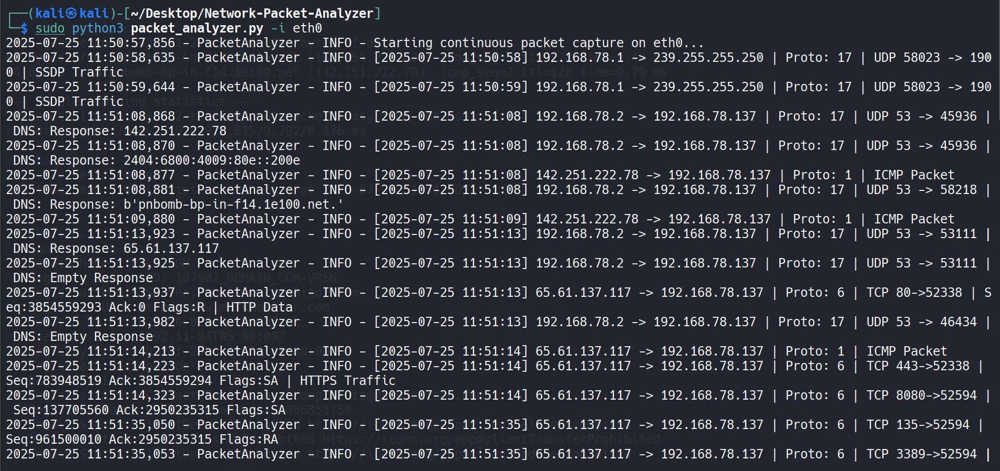
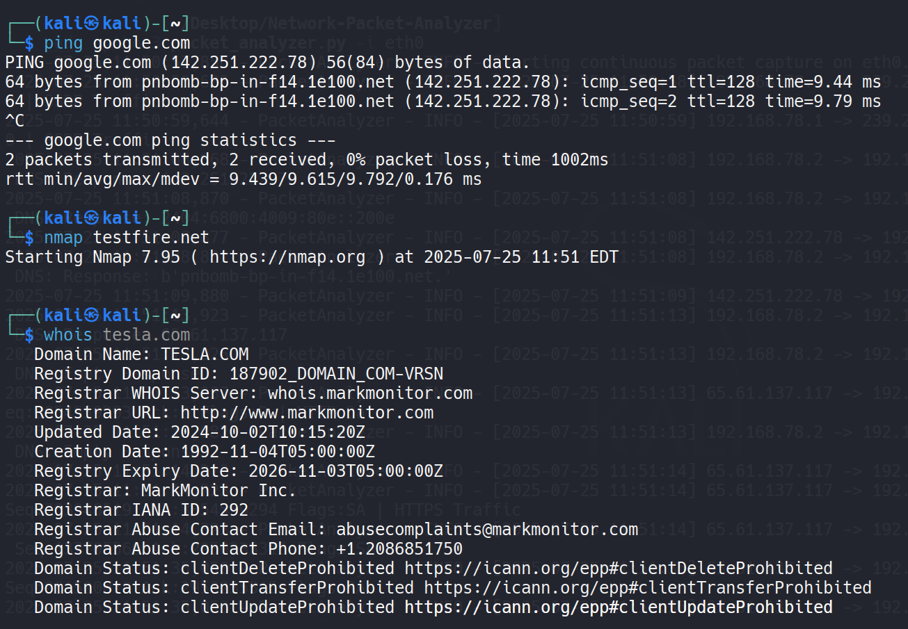
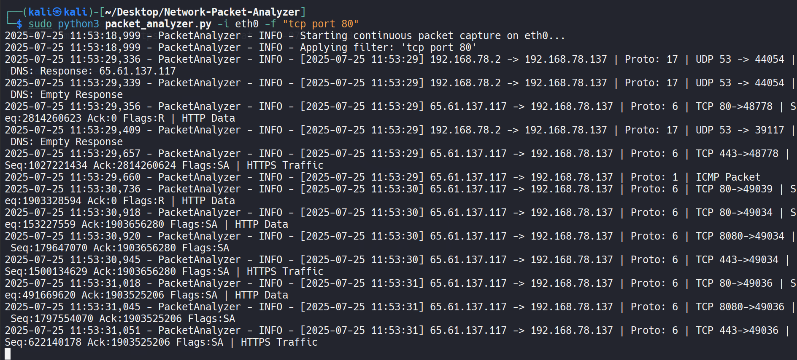

# 🛡️ Network Packet Analyzer (Python + Scapy)

A custom **network packet analyzer** written in Python using **Scapy**. It captures and inspects real-time network traffic including IP, TCP, UDP, DNS, HTTP, HTTPS, ICMP, and more.

> 🔬 Built as part of my hands-on cybersecurity learning to simulate threat detection and understand packet-level inspection.

---

## 🚀 Features

- Live packet capturing on selected interface
- Protocol-wise analysis: TCP, UDP, HTTP, DNS, ICMP
- HTTP method/host/path extraction
- DNS query/response parsing
- BPF filter support (e.g., `tcp port 80`)
- Logging to file
- Supports IPv4 and IPv6

---

## 🧪 Demo Screenshots

📸 Packet capture with ICMP, DNS, TCP:  


📸 Ping, Nmap, Whois test:  


📸 Port 80 filtering with HTTP/HTTPS:  


---

## ⚙️ Usage

```bash
# Basic usage
sudo python3 packet_analyzer.py -i eth0

# With filter
sudo python3 packet_analyzer.py -i eth0 -f "tcp port 80"

# Capture fixed number of packets
sudo python3 packet_analyzer.py -i eth0 -c 100

# Log to file
sudo python3 packet_analyzer.py -i eth0 -l logs.txt
```

> ℹ️ Run with `sudo` as raw sockets require privileges.

---

## 📁 File Structure

```
├── packet_analyzer.py
├── screenshots/
│   ├── packet-capture.png
│   ├── ping-nmap-whois.png
│   └── filter-port80.png
├── README.md
├── LICENSE
```

---

## 👨‍💻 Author

**Shivshant Patil**  
Cybersecurity Enthusiast | CEH v13 | Red Team Learner  
📧 shivshantp007@gmail.com  
🔗 [LinkedIn](https://www.linkedin.com/in/shivshant-patil-b58aaa281)
